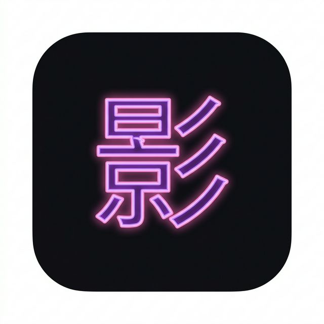

<div align="center">



# 影 KageView

**App de escritorio para streaming de anime — sin anuncios, en español e inglés.**

[](https://www.gnu.org/licenses/gpl-3.0)
[](https://electronjs.org)
[](https://reactjs.org)
[](https://typescriptlang.org)
[]()

<br/>

*"Mientras otros veían anime, yo construí el lugar donde verlo."*

<br/>

[**⬇️ Descargar**](#-descarga) · [**✨ Features**](#-features) · [**🛠️ Desarrollo**](#️-desarrollo) · [**🔌 Providers**](#-providers)

</div>

---

## ✨ Features

| Feature | Descripción |
|---------|-------------|
| 🚫 **Sin anuncios** | Cero popups, cero tracking, siempre |
| 🌍 **Español + Inglés** | Sub y dub en ambos idiomas por separado |
| ⚡ **Fallback automático** | 5 providers — si uno falla, el siguiente entra solo |
| 📺 **Player integrado** | HLS nativo, skip intro/outro, velocidad, fullscreen |
| 🔗 **AniList Sync** | Watchlist, progreso y puntuaciones en tiempo real |
| 🖥️ **Windows & Linux** | `.exe`, `.AppImage` y `.deb` disponibles |
| 🎨 **Cinematic Shadow UI** | Design system oscuro con glows y glassmorphism |

---

## 🔌 Providers

KageView conecta múltiples fuentes y cambia automáticamente si una falla:

| Provider | Idioma | Sub | Dub | Estado |
|----------|--------|-----|-----|--------|
| 🟢 AnimeFLV | 🇪🇸 Español | ✅ | ✅ | Activo |
| 🟢 JKAnime | 🇪🇸 Español | ✅ | ✅ | Activo |
| 🟢 HiAnime | 🇺🇸 Inglés | ✅ | ✅ | Activo |
| 🟡 Gogoanime | 🇺🇸 Inglés | ✅ | ✅ | Inestable |
| 🟢 AnimePahe | 🇺🇸 Inglés | ✅ | ✅ | Activo |

> Cuando seleccionas **español** como idioma de audio, KageView prioriza AnimeFLV y JKAnime automáticamente.

---

## ⬇️ Descarga

| Sistema | Archivo | |
|---------|---------|--|
| Windows 10/11 | `KageView.Setup.1.0.0.exe` | [Descargar](../../releases/latest) |
| Linux (Universal) | `KageView-1.0.0.AppImage` | [Descargar](../../releases/latest) |
| Linux (Debian/Ubuntu) | `kageview_1.0.0_amd64.deb` | [Descargar](../../releases/latest) |

---

## 🛠️ Desarrollo

### Requisitos

- [Node.js 20+](https://nodejs.org/)
- npm 9+
- Credenciales de AniList (ver abajo)

### Instalación

```bash
git clone https://github.com/pedromoorales9/KageView
cd KageView
npm install
```

### Configurar AniList

1. Ve a [AniList Developer Settings](https://anilist.co/settings/developer)
2. Crea una nueva aplicación
3. Pon como Redirect URI: `kageview://auth`
4. Copia `clientId` y `clientSecret`
5. Edita `src/modules/clientData.ts`:

```ts
export const clientData: ClientData = {
  clientId: TU_CLIENT_ID,
  clientSecret: "TU_CLIENT_SECRET",
  redirectUri: "kageview://auth",
};
```

> ⚠️ `clientData.ts` está en `.gitignore`. Nunca lo subas a GitHub.

### Lanzar en desarrollo

```bash
npm start
```

### Scripts disponibles

| Comando | Descripción |
|---------|-------------|
| `npm start` | Modo desarrollo con hot reload |
| `npm run build` | Build de producción |
| `npm run dist:win` | Instalador `.exe` para Windows |
| `npm run dist:linux` | `.AppImage` + `.deb` para Linux |
| `npm run typecheck` | Verificar TypeScript sin compilar |
| `npm run lint` | ESLint sobre todo el proyecto |

---

## 🧱 Tech Stack

```
Electron 28          →  Runtime de escritorio
React 18             →  UI framework
TypeScript 5         →  Tipado estático
Tailwind CSS 3       →  Estilos con design tokens
Zustand 4            →  Estado global
HLS.js               →  Streaming de video
electron-store 8     →  Persistencia local
AniList GraphQL v2   →  Metadatos y autenticación
AniSkip API v2       →  Timestamps de intro/outro
fastest-levenshtein  →  Title matching entre providers
```

---

## 🎨 Design System — Cinematic Shadow

Desarrollado con [Stitch by Google](https://stitch.withgoogle.com). Tokens principales:

```css
--background:               #0e0e13;  /* Base canvas */
--primary:                  #cb97ff;  /* Morado — acción principal */
--secondary:                #f673b7;  /* Rosa — acento */
--surface-container:        #19191f;  /* Cards */
--surface-container-highest:#25252c;  /* Hover states */
--on-surface:               #f8f5fd;  /* Texto principal */
--on-surface-variant:       #acaab1;  /* Texto secundario */
```

**Tipografía:** Plus Jakarta Sans (headlines) + Inter (body)

---

## 📁 Estructura del proyecto

```
src/
├── main/                   # Proceso principal Electron
│   ├── main.ts             # Entry point, IPC handlers
│   └── preload.ts          # Bridge seguro main ↔ renderer
├── modules/
│   ├── providers/          # Sistema modular de fuentes
│   │   ├── IProvider.ts    # Interfaz común
│   │   ├── registry.ts     # Registro + fallback automático
│   │   ├── animeflv.ts     # 🇪🇸 AnimeFLV
│   │   ├── jkanime.ts      # 🇪🇸 JKAnime
│   │   ├── hianime.ts      # 🇺🇸 HiAnime
│   │   ├── gogoanime.ts    # 🇺🇸 Gogoanime
│   │   └── animepahe.ts    # 🇺🇸 AnimePahe
│   ├── anilist/            # AniList GraphQL
│   ├── aniskip.ts          # Skip intro/outro
│   ├── store.ts            # Zustand global store
│   └── cache.ts            # Persistencia via IPC
└── renderer/
    ├── pages/              # Discover, Library, Search, Settings
    ├── components/         # Sidebar, Player, Modal, Cards
    └── hooks/              # useAniList, useProvider, useAnimeInfo
```

---

## ⚠️ Aviso legal

KageView no aloja ningún contenido. Actúa únicamente como cliente que enlaza a contenido disponible en sitios de terceros. Todo el contenido es responsabilidad de dichos sitios. El desarrollador no se hace responsable del uso del contenido enlazado.

---

## 🤝 Contribuir

Las contribuciones son bienvenidas. Si encuentras un bug o quieres proponer una mejora:

1. Abre un [Issue](../../issues)
2. Haz fork del repositorio
3. Crea una rama: `git checkout -b fix/nombre-del-fix`
4. Commit: `git commit -m "fix: descripción"`
5. Pull Request

---

<div align="center">

**GPL-3.0 © 2026 [Sh4Dow](https://github.com/pedromoorales9) — Gran Canaria, España**

*Hecho con ♥ y demasiadas horas de madrugada.*

</div>
