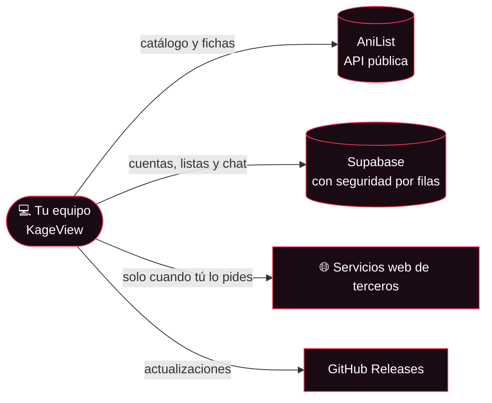

<div align="center">


<br/>

[](https://github.com/pedromoorales9/kageview/releases/latest)
[](https://github.com/pedromoorales9/kageview/releases)
[](LICENSE)


**[⬇️ Descargar](#️-descarga)** · **[✨ Funciones](#-funciones)** · **[🔐 Privacidad](#-privacidad-y-seguridad)** · **[🛠️ Desarrollo](#️-desarrollo)** · **[📋 Novedades](#-novedades)** · **[⚖️ Aviso legal](#️-aviso-legal-y-descargo-de-responsabilidad)**

</div>

<div align="center">

<br/>

<a href="docs/KageView-anuncio.mp4"></a>

<sub>▶️ <a href="docs/KageView-anuncio.mp4"><b>Ver el vídeo completo</b></a> (24 s, con sonido)</sub>

</div>

---

## 🌙 ¿Qué es KageView?

**KageView** es una aplicación de escritorio de código abierto, para Windows y macOS, que reúne en una sola interfaz cuidada el **catálogo de anime y manga**, un **reproductor y un lector** cómodos, tu **biblioteca personal** y una pequeña **red social** para compartir lo que ves y lees con tus amigos.

> 🛡️ **KageView no aloja, almacena ni distribuye ningún contenido protegido por derechos de autor.** Es un cliente que muestra información pública y se conecta, a petición del usuario y desde su propio equipo, a servicios web de terceros. Lee el [aviso legal](#️-aviso-legal-y-descargo-de-responsabilidad) antes de usarla.

---

## ✨ Funciones

<table>
<tr>
<td width="33%" valign="top">

### 📺 Reproductor
Velocidad, pantalla completa, salto de intro y outro, y **siguiente episodio automático** con cuenta atrás. Si una fuente falla, prueba otra sin interrumpirte.

</td>
<td width="33%" valign="top">

### 📚 Lector de manga
**Retoma por donde lo dejaste** (capítulo y página), modo cascada, páginas o derecha a izquierda, atajos de teclado, precarga y ahorro de datos.

</td>
<td width="33%" valign="top">

### 🗂️ Biblioteca
Tus listas de anime y manga con estados, **aviso de capítulos nuevos** y sincronización entre tus dispositivos.

</td>
</tr>
<tr>
<td valign="top">

### 👥 Amigos
Añade amigos, mira **qué están viendo y leyendo ahora** y explora sus listas. Tú decides qué se comparte.

</td>
<td valign="top">

### 💬 Chat
Mensajes en tiempo real, **respuestas con cita** (arrastra un mensaje hacia la derecha), tarjetas para recomendar un anime o un manga.

</td>
<td valign="top">

### 📅 Calendario
Vista semanal de emisión con **cuenta atrás** y avisos nativos cuando sale un episodio nuevo.

</td>
</tr>
<tr>
<td valign="top">

### 🔄 Siempre al día
Se **actualiza sola** en Windows y en macOS: te avisa de cada versión y la instala con un clic.

</td>
<td valign="top">

### 🎮 Discord
*Rich Presence* opcional: muestra en tu perfil lo que estás viendo. Se apaga cuando quieras.

</td>
<td valign="top">

### 🎨 Diseño «Luna de sangre»
Interfaz oscura y fluida pensada para macOS y Windows: cristal, pétalos de sakura y animaciones sin gastar batería en reposo.

</td>
</tr>
</table>

### 🧭 Cómo funciona


```mermaid
flowchart LR
    U(["💻 Tu equipo<br/>KageView"])
    U -- "catálogo y fichas" --> A[("AniList<br/>API pública")]
    U -- "cuentas, listas y chat" --> S[("Supabase<br/>con seguridad por filas")]
    U -- "solo cuando tú lo pides" --> T["🌐 Servicios web de terceros"]
    U -- "actualizaciones" --> G["GitHub Releases"]
    classDef n fill:#1a0a14,stroke:#ff3d5a,color:#ffffff;
    class U,A,S,T,G n;
```

KageView **no tiene servidores de contenido**: las consultas a servicios de terceros las hace tu propio equipo, y esos servicios son los únicos responsables de lo que publican.

---

## ⬇️ Descarga

| Sistema | Archivo | |
|---------|---------|--|
| 🪟 Windows 10 / 11 | `KageView-Setup-x.y.z.exe` | [**Descargar →**](https://github.com/pedromoorales9/kageview/releases/latest) |
| 🍎 macOS 11+ (Apple Silicon e Intel) | `KageView-x.y.z-mac.dmg` | [**Descargar →**](https://github.com/pedromoorales9/kageview/releases/latest) |
| 🐧 Linux | — | Próximamente |

> Descarga siempre desde la [página oficial de *Releases*](https://github.com/pedromoorales9/kageview/releases). Cualquier otro sitio que ofrezca KageView no está bajo mi control.

### 🍎 Instalar en macOS

1. Abre `KageView-x.y.z-mac.dmg` y **arrastra KageView a Aplicaciones**.
2. La **primera vez**, macOS mostrará un aviso porque la app aún no está firmada con un Developer ID de Apple. Es normal; se autoriza una sola vez:
   - **macOS 15 (Sequoia) o posterior:** intenta abrir KageView → *Ajustes del Sistema → Privacidad y seguridad* → baja hasta el aviso de KageView y pulsa **Abrir igualmente**.
   - **macOS 14 o anterior:** en *Aplicaciones*, **clic derecho sobre KageView → Abrir → Abrir**.
3. Si macOS dijera que la app «está dañada», abre la Terminal y ejecuta: `xattr -dr com.apple.quarantine /Applications/KageView.app`

**Actualizaciones:** a partir de la 1.5.0, KageView se actualiza sola también en Mac (avisa al abrir; basta pulsar *Inicializar actualización* y *Reiniciar e instalar*). Si la app no está en *Aplicaciones*, el aviso te lo explica y ofrece descargar a mano.

---

## 🔐 Privacidad y seguridad

- **Sin telemetría ni analítica propias.** KageView no incluye herramientas de seguimiento de uso.
- **Cuenta opcional.** Sin cuenta, la app funciona en local. Con cuenta se guardan tu correo, nombre de usuario, foto, listas, progreso de lectura y mensajes en el proyecto de [Supabase](https://supabase.com) configurado en la aplicación.
- **Tú controlas lo que ven tus amigos:** puedes ocultar tu actividad («viendo/leyendo ahora») y tus listas desde tu perfil. Solo los amigos aceptados pueden ver algo.
- **Seguridad en la base de datos:** los permisos los imponen políticas de seguridad por filas (*RLS*) verificadas con tests automáticos (`npm test`), no la interfaz.
- **Los mensajes no están cifrados de extremo a extremo.** No compartas información sensible por el chat.
- **Eliminar tu cuenta** (*Perfil → Eliminar cuenta*) borra tus datos de la base de datos.
- **Conexiones a terceros:** cuando consultas un servicio web de terceros, ese servicio ve tu dirección IP, como en cualquier navegador.
- **Contenido para mayores de edad:** los listados de manga lo ocultan por defecto; hay que activar expresamente la opción «Contenido +18», y solo si eres mayor de edad en tu país.

---

## 🛠️ Desarrollo

### Requisitos

- [Node.js 20+](https://nodejs.org/)
- npm 9+
- (Opcional) Un proyecto de [Supabase](https://supabase.com) para las cuentas (ver abajo)

### Instalación

```bash
git clone https://github.com/pedromoorales9/KageView
cd KageView
npm install
```

### Configurar las cuentas (Supabase)

Las cuentas, listas, amigos, el chat y el «viendo ahora» viven en **Supabase**. AniList solo se usa como catálogo público (tendencias, búsqueda, fichas): no hace falta cuenta ni credenciales de AniList.

1. Crea un proyecto en [supabase.com](https://supabase.com).
2. Sigue la guía **[`supabase/README.md`](supabase/README.md)** (aplicar el SQL, configurar el correo y la URL de redirección `kageview://auth-callback`).
3. Crea un `.env` en la raíz (parte de `.env.example`):

```bash
SUPABASE_URL=https://xxxx.supabase.co
SUPABASE_ANON_KEY=tu_anon_key_publica
```

> 🔐 La `anon key` es **pública por diseño** (va dentro de la app); los datos los protegen las políticas RLS de `supabase/migrations`, cubiertas por `npm test`. **Nunca** pongas la clave `service_role` en la app ni en el `.env`.
> Sin estas variables la app funciona igualmente, pero sin cuentas.

Para probar la interfaz sin proyecto de Supabase existe un backend en memoria **solo para desarrollo** con usuarios de ejemplo:

```bash
KAGEVIEW_BACKEND=mock npm start
```

> En modo *mock* puedes entrar como `kage@demo.dev` (owner) o `sora@demo.dev` (admin), contraseña `demo1234`, para probar el **panel de administración** (Ajustes → Administración). En producción, ver «Administración» en [`supabase/README.md`](supabase/README.md).

### Sincronización con AniList (opcional)

Para que la compilación pueda conectar cuentas de AniList hace falta un *Client ID* (público, sin secreto):

1. Entra en [anilist.co/settings/developer](https://anilist.co/settings/developer) → **Create New Client**.
2. **Name:** KageView · **Redirect URL:** `kageview://anilist-auth`
3. Copia el número **ID** al `.env` (`ANILIST_CLIENT_ID=…`). El *Secret* no se usa.

Sin él, la sección de AniList no aparece en Ajustes. Para probar la interfaz sin cuenta: `KAGEVIEW_ANILIST=mock npm start` (AniList de mentira con listas de ejemplo).

### Discord Rich Presence (opcional)

Crea una aplicación en el [Discord Developer Portal](https://discord.com/developers/applications) y añade su Application ID al `.env`:

```bash
DISCORD_CLIENT_ID=tu_application_id
```

Sin él, la función queda desactivada silenciosamente. Se puede apagar en cualquier momento desde **Ajustes → Integraciones**.

### Lanzar en desarrollo

```bash
npm start
```

### Tests

```bash
npm test
```

Incluyen las políticas de seguridad de la base de datos (sobre Postgres real en memoria), la lógica del chat y la sincronización, y los conectores de fuentes con datos de ejemplo. Los conectores tienen además pruebas «en vivo» opcionales, útiles para detectar cuándo un servicio externo cambia y deja de funcionar:

```bash
LIVE=1 npx vitest run src/modules/manga/__tests__/provider-<id>.live.test.ts
```

### Compilar instalador Windows

```bash
npm run dist:win
```

El instalador se genera en `release/build/KageView-Setup-x.x.x.exe`.

### Compilar instalador macOS

```bash
npm run dist:mac
```

Genera `release/build/KageView-x.x.x-mac.dmg`: un único instalador **universal** (Apple Silicon + Intel) con ventana de instalación propia. Necesita el `.env` con las claves públicas de Supabase, que se incrustan en la build.

- **Iconos y fondo del instalador:** se generan con `npm run assets:build`. Solo hay que repetirlo si cambian `assets/icon.png` o el diseño del fondo.
- **Firma:** sin certificado, la app se firma *ad-hoc* (necesario para arrancar en Apple Silicon) y los usuarios deben autorizarla la primera vez (ver arriba). Con una cuenta de [Apple Developer Program](https://developer.apple.com/programs/) se elimina ese paso: define `CSC_LINK` + `CSC_KEY_PASSWORD` y las credenciales de notarización `APPLE_API_KEY`, `APPLE_API_KEY_ID`, `APPLE_API_ISSUER`, y el mismo comando firma con *hardened runtime* y notariza. La actualización automática no depende de ello: en Mac usa un actualizador propio (`src/main/macUpdater.ts`) que descarga el `.zip` de la release, comprueba su SHA-512 y sustituye la app al reiniciar.
- **Publicar:** sube a la release de GitHub el `.dmg`, el `.zip` y `latest-mac.yml` (además de los archivos de Windows).

### 🧱 Tecnologías

```
Electron 28          →  Runtime de escritorio + IPC
React 18             →  Interfaz
TypeScript 5         →  Tipado estático
Tailwind CSS 3       →  Estilos con design tokens
Zustand 4            →  Estado global
HLS.js               →  Reproducción HLS
electron-store 8     →  Persistencia local
electron-updater 6   →  Auto-actualizaciones (Windows) desde GitHub Releases; en macOS, actualizador propio
AniList GraphQL v2   →  Catálogo público de anime (sin cuenta)
Supabase             →  Cuentas, listas, amigos y chat (RLS + Realtime)
AniSkip API v2       →  Marcas de intro/outro
Discord IPC nativo   →  Rich Presence sin dependencias
Vitest               →  Tests
```

### 📁 Estructura del proyecto

```
src/
├── main/                  # Proceso principal de Electron (ventana, menú, actualizaciones, red)
├── modules/
│   ├── backend/           # Cuentas, amigos, chat (Supabase + backend en memoria para desarrollo)
│   ├── providers/         # Conectores de anime y registro con respaldo automático
│   ├── manga/             # Conectores de manga, lector, biblioteca y sincronización
│   ├── anilist/           # Cliente GraphQL del catálogo público
│   └── …                  # chat, social, presencia, caché, estado global
└── renderer/
    ├── pages/             # Descubrir, Biblioteca, Búsqueda, Manga, Calendario, Amigos, Ajustes
    ├── components/        # Reproductor, lector, tarjetas, chat, panel de administración…
    └── hooks/
supabase/                  # Migraciones SQL, políticas de seguridad y sus tests
docs/                      # Recursos del README
```

---

## 📋 Novedades

### v1.8.1 — Cierre en macOS
- **Corregido:** en macOS, al pulsar la X (el botón rojo) la app seguía abierta y había que usar clic derecho → *Salir* en el Dock. Ahora **se cierra por completo**, igual que en Windows
- **Corregido:** las fichas de manga de fuentes solo en inglés mostraban «En español» y un botón «+ Inglés» sin sentido
- Mejoras internas: más pruebas automáticas y base preparada para futuras integraciones

### v1.8.0 — Más fuentes de manga
- **7 fuentes nuevas de manga** (ahora hay 11): varias en español y dos solo en inglés, que se marcan con «EN». Admiten búsqueda, populares, recientes, paginación y, casi todas, géneros
- Funcionan con la **búsqueda en todas las fuentes**, la biblioteca, el progreso sincronizado y compartir por el chat
- Solo se incorporan servicios que se pueden consultar con normalidad: no se intenta saltar captchas, inicios de sesión ni muros de pago

### v1.7.0 — Copiar y pegar, y responder en el chat
- **Copiar y pegar funcionan en toda la app** (⌘C / ⌘V / ⌘X / ⌘A / ⌘Z): faltaba el menú *Edición*, y en macOS los atajos pasan por él. Además hay **menú de clic derecho** en los campos de texto
- **Responder a un mensaje con cita**: arrastra el mensaje hacia la derecha (ratón, táctil o dos dedos en el trackpad) o pulsa ↩. Al pulsar la cita se salta al mensaje original
- Requiere aplicar `20261003000007_chat_replies.sql` (ver `supabase/README.md`)

### v1.6.0 — Manga a fondo y manga en tu cuenta
- **Retoma donde lo dejaste** (capítulo y página), biblioteca con estados, insignia «+N» de capítulos nuevos y lista de capítulos ordenada igual en todas las fuentes
- Lector: modo derecha-a-izquierda, interfaz que se oculta sola, atajos, precarga y ahorro de datos, con reintento por página
- Búsqueda en todas las fuentes a la vez, géneros y orden, y marcar capítulos como leídos
- **Biblioteca y progreso sincronizados** entre dispositivos; tus amigos ven lo que lees y pueden ver tu biblioteca (según tu privacidad); **compartir un manga por el chat**
- Requiere aplicar `20261002000006_manga_cloud.sql`

### v1.5.0 — Actualizaciones automáticas en macOS
- KageView se actualiza sola también en Mac. La descarga se verifica (SHA-512, identificador, versión y firma) antes de sustituir la app, y si algo falla se restaura la anterior
- Quien tenga una versión anterior en Mac debe instalar esta a mano una vez

<details>
<summary><b>Versiones anteriores</b></summary>

### v1.4.1 — Panel de administración v2
- Corregido el interruptor de servicios del panel; nuevo menú lateral, resumen con gráfica, moderación (suspender usuarios), registro de actividad inalterable, anuncios con plantillas y segmentación

### v1.4.0 — Panel de administración y anuncios
- Roles *owner* y *admin* (la autorización la impone la base de datos), anuncios para todos los usuarios, fuentes que se pueden apagar con un motivo visible y cifras agregadas sin ver listas ni mensajes

### v1.3.0 — Rediseño para macOS, cuentas, amigos e instalador
- Rediseño completo «Luna de sangre», cuentas propias con Supabase, amigos, «viendo ahora», chat en tiempo real e instalador `.dmg` universal
- Rendimiento: sin animaciones infinitas en reposo (de ~40 % de CPU/GPU a 0 %) e iconos incluidos en la app (sin descargar fuentes externas)

### v1.2.0 — Discord Rich Presence, preferencias y tests
- Rich Presence nativo, preferencias persistentes y suite de tests

### v1.1.0 — Nueva fuente de manga, interfaz adaptable y login propio
- Nueva fuente de manga en español con filtro de contenido +18
- Lista de episodios en cuadrícula con orden y carga por lotes, buscador de episodios e interfaz adaptable al ancho de ventana
- Login con tu propia cuenta: la app ya no incrusta ningún secreto de cliente

### v1.0.x
- Proveedor favorito, calendario de emisión con cuenta atrás y notificaciones nativas, cuenta atrás para el siguiente episodio, carrusel de la página principal y primera versión con auto-actualizaciones desde GitHub Releases

</details>

---

## ⚖️ Aviso legal y descargo de responsabilidad

**Naturaleza del software.** KageView es un cliente de escritorio de código abierto y de uso general. **No aloja, almacena, sube, transmite ni distribuye** vídeos, imágenes, capítulos ni ningún otro contenido protegido, y no dispone de servidores de contenido. Solo muestra información y enlaces procedentes de servicios web de terceros en el momento en que el usuario lo solicita, directamente desde el equipo del usuario.

**Derechos de autor y marcas.** Todas las obras, imágenes, nombres y marcas mencionados o mostrados pertenecen a sus respectivos titulares. KageView **no está afiliado, patrocinado ni respaldado** por ellos ni por ninguno de los servicios de terceros a los que pueda conectarse. AniList, Supabase, Discord, GitHub, Apple, Microsoft y otros nombres citados lo son únicamente a título identificativo; KageView no es un producto oficial de ninguno de ellos.

**Servicios de terceros.** El desarrollador no controla, revisa ni garantiza el contenido, la disponibilidad ni la licitud de los servicios de terceros, y no asume responsabilidad alguna por ellos. Las condiciones de uso de cada servicio son responsabilidad exclusiva de quien lo utiliza.

**Responsabilidad del usuario.** Cada usuario es el único responsable del uso que haga del software y de los contenidos a los que acceda con él. Debes cumplir la legislación de propiedad intelectual y las condiciones de los servicios aplicables en tu país. Si una obra está disponible en un servicio oficial en tu región, te animamos a usarlo y a **apoyar a sus creadores**.

**Retirada de contenidos y reclamaciones.** KageView no aloja contenido, por lo que no puede retirarlo. Si eres titular de derechos y consideras que una referencia incluida en este repositorio infringe tus derechos, abre un [Issue](../../issues) indicando qué referencia es y cómo acreditar la titularidad. Se atenderá con diligencia y, cuando proceda, se retirará la referencia de la aplicación.

**Sin garantía.** El software se ofrece **«tal cual»**, sin garantía de ningún tipo (ver [licencia](LICENSE)). El autor no responde de daños derivados de su uso, de la indisponibilidad de servicios externos ni de la pérdida de datos.

**Contenido para adultos.** Algunos servicios de terceros pueden ofrecer material solo apto para mayores de edad. La aplicación lo oculta por defecto en los listados de manga; activarlo es decisión y responsabilidad exclusivas del usuario, que debe ser mayor de edad según la ley de su país.

**Licencia.** Código publicado bajo licencia [MIT](LICENSE). La licencia cubre el código de KageView, no los contenidos de terceros.

---

## 🤝 Contribuir

1. Abre un [Issue](../../issues) para comentar la idea o el fallo
2. Haz fork del repositorio
3. Crea una rama: `git checkout -b fix/nombre-del-fix`
4. Haz commit: `git commit -m "fix: descripción"`
5. Abre un Pull Request

> No se aceptarán contribuciones que añadan enlaces a contenido que se sepa ilícito, ni que eludan medidas técnicas de protección (captchas, cifrado/DRM, inicios de sesión o muros de pago).

---

<div align="center">

**MIT © 2026 Sh4Dow**

*Hecho con ♥ y demasiadas horas de madrugada.*

</div>
